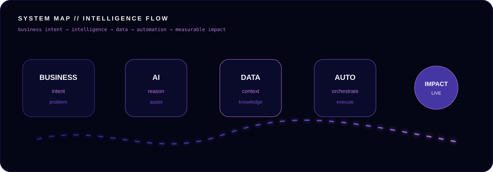
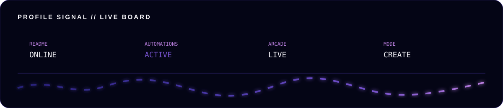

<div align="center">


<br>

<a href="https://lameskhaled.github.io/Lamees-khaled-Portifolio/">
  
</a>
&nbsp;
<a href="https://www.linkedin.com/in/lames-khaled">
  
</a>

<br><br>


</div>

---

<div align="center">

### `> WHOAMI`

# I DON'T JUST AUTOMATE TASKS.
## I DESIGN SYSTEMS THAT THINK, ACT & SCALE.

I build at the intersection of **intelligent automation, enterprise systems and AI** — turning fragmented processes into digital experiences that are simpler, faster and more reliable.

<br>

`COMPLEXITY` → `CLARITY` → `DESIGN` → `AUTOMATION` → `INTELLIGENCE` → `IMPACT`

</div>

---

## 01 // SYSTEM MAP

<div align="center">

</div>

---

## 02 // THE STACK IS ALIVE

<div align="center">


<br><br>


<br><br>

`Power Platform` · `Power Apps` · `Power Automate` · `Dataverse` · `Copilot Studio`  
`UiPath` · `Azure OpenAI` · `REST APIs` · `SAP` · `Cloud` · `Monitoring`

</div>

---

## 03 // MISSION CONTROL

<div align="center">

</div>

---

## 04 // ARCADE MODE 🎮

<div align="center">

### `PAC-MAN // EATING THE BUILD TRAIL`

<picture>
  <source media="(prefers-color-scheme: dark)" srcset="https://raw.githubusercontent.com/lameskhaled/lameskhaled/output/pacman-contribution-graph-dark.svg">
  <source media="(prefers-color-scheme: light)" srcset="https://raw.githubusercontent.com/lameskhaled/lameskhaled/output/pacman-contribution-graph.svg">
  
</picture>

<br>

### `BREAKOUT // BREAK THE GRID`

<picture>
  <source media="(prefers-color-scheme: dark)" srcset="https://raw.githubusercontent.com/lameskhaled/lameskhaled/output/breakout-contribution-graph-dark.svg">
  <source media="(prefers-color-scheme: light)" srcset="https://raw.githubusercontent.com/lameskhaled/lameskhaled/output/breakout-contribution-graph.svg">
  
</picture>

<br>

### `GALAGA // SHOOT THE CONTRIBUTIONS`

<picture>
  <source media="(prefers-color-scheme: dark)" srcset="https://raw.githubusercontent.com/lameskhaled/lameskhaled/output/galaga-contribution-graph-dark.svg">
  <source media="(prefers-color-scheme: light)" srcset="https://raw.githubusercontent.com/lameskhaled/lameskhaled/output/galaga-contribution-graph.svg">
  
</picture>

</div>

---

## 05 // SNAKE PROTOCOL 🐍

<div align="center">

<picture>
  <source media="(prefers-color-scheme: dark)" srcset="https://raw.githubusercontent.com/lameskhaled/lameskhaled/output/github-contribution-grid-snake-dark.svg"/>
  <source media="(prefers-color-scheme: light)" srcset="https://raw.githubusercontent.com/lameskhaled/lameskhaled/output/github-contribution-grid-snake.svg"/>
  
</picture>

</div>

---

## 06 // PROFILE SIGNAL

<div align="center">

</div>

---

## 07 // HOW MY BRAIN RUNS

```text
INPUT: messy problem

        ↓
OBSERVE
        ↓
QUESTION
        ↓
SIMPLIFY
        ↓
DESIGN
        ↓
BUILD
        ↓
BREAK IT
        ↓
FIX IT BETTER
        ↓
SHIP
        ↓
LEARN

OUTPUT: something people actually want to use
```

<div align="center">

### BUSINESS FIRST. TECHNOLOGY SECOND.

I don't begin with **“What can this tool do?”**

I begin with:

## “What should this experience feel like when we're finished?”

</div>

---

## 08 // CURRENT OPERATING SYSTEM

```yaml
name: Lames Khaled
mode: build
specialty:
  - intelligent automation
  - enterprise AI
  - digital systems
default_state: curious
quality_gate: "working isn't enough"
error_handling: "investigate → understand → improve"
mission: "make complexity feel simple"
```

---

<div align="center">


<br>

<a href="https://lameskhaled.github.io/Lamees-khaled-Portifolio/">
  
</a>

<br><br>

`INTELLIGENT AUTOMATION × ENTERPRISE AI × DIGITAL SYSTEMS`

</div>
