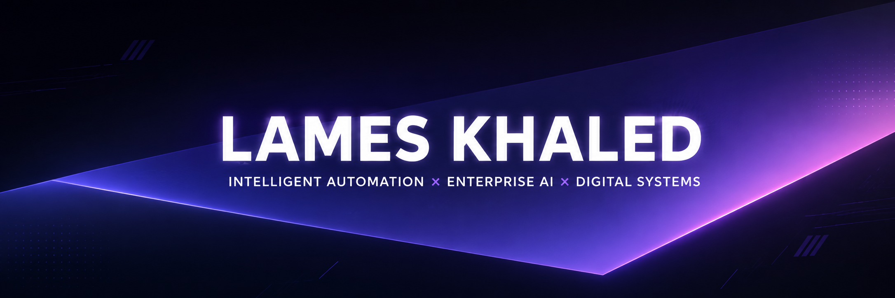
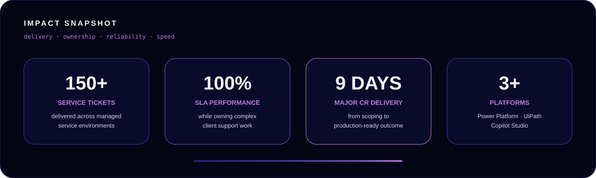
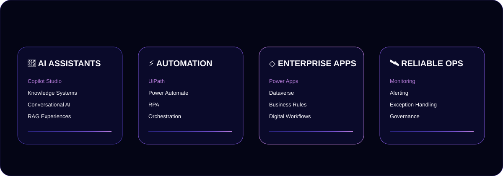
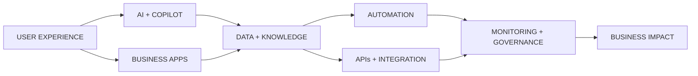

 

 

  

# I build intelligent systems people can actually use.

I am a **Senior Intelligent Automation Consultant** working across **AI, automation, enterprise applications and digital operations**.

I turn complex processes into systems that are **clearer, faster, more reliable and easier to scale** — combining technical depth with product thinking, ownership and a strong bias toward practical outcomes.

  

 

 

## Impact
 

- Delivered and supported **150+ managed-service tickets** across complex client environments.
- Maintained **100% SLA performance** across a sustained delivery period.
- Delivered a major change request in **9 days**, balancing speed, quality and stakeholder alignment.
- Worked across **Power Platform, UiPath and Copilot Studio**, including apps, automation, AI assistants, monitoring and support.
- Comfortable owning work end-to-end: **scope → design → build → test → deploy → support → improve**.

 

## What I Build

 

 

## System Architecture

## Featured Work

### AI Service Assistant
Built and tested a **Copilot Studio assistant** connected to enterprise service workflows, focused on helping users retrieve ticket information, raise incidents and navigate support journeys more naturally.

### Monitoring & Alerting
Designed monitoring logic around operational signals, exception states and escalation paths to make automation support more proactive and easier to investigate.

### Enterprise App Delivery
Worked on **Power Apps / Dataverse solutions**, business rules, change requests, testing and production support across live client environments.

### Automation Engineering
Built and supported automation solutions using **UiPath, Power Automate, APIs, SAP, Excel and cloud services**, with an emphasis on reliability and maintainability.

 

## Tech Ecosystem

  

🟣 Automation
🟪 Power Platform
🟡 Enterprise
🩵 Cloud
🩷 Integrations
🤖 AI
📊 Monitoring
  

 

## How I Work

I don’t just automate tasks.

**I design systems that think, act, and scale.**
 

────────

## 01 · SYSTEM MAP

---

### Users shouldn’t have to understand the architecture.
### **They should feel the result.**

 

| 🔍 **THINK** | ⚙️ **BUILD** | 🚀 **DELIVER** |
|:---:|:---:|:---:|
| Understand the problem | Design the system | Create the outcome |
| Simplify complexity | Build with intent | Deliver measurable impact |

 

**COMPLEXITY → CLARITY → DESIGN → AUTOMATION → INTELLIGENCE → IMPACT**

---

## 02 · ENGINEERING MINDSET

### ⚙️ ENGINEERING MINDSET

**THINK** · **DESIGN** · **BUILD** · **VALIDATE** · **EVOLVE**

 

Understand the problem · Simplify the complexity · Build with intent ·
Validate the result · Improve continuously

 

> **Build less. Think more. Ship better.**

---

## 03 · BUSINESS FIRST. TECHNOLOGY SECOND.

### The tool is never the point.
### **The outcome is.**

 

| **01 · PROBLEM** | **02 · SOLUTION** | **03 · SYSTEM** | **04 · IMPACT** |
|:---:|:---:|:---:|:---:|
| Understand what matters | Simplify the approach | Build for scale | Measure the outcome |

 

I start with the problem, design around the user, and use technology to create
**simpler, faster, and more reliable outcomes.**

---

## 🎮 Gaming & Side Quests

A completely unnecessary but highly important section.

### PAC-MAN

<picture>
  <source media="(prefers-color-scheme: dark)" srcset="https://raw.githubusercontent.com/lameskhaled/lameskhaled/output/pacman-contribution-graph-dark.svg">
  <source media="(prefers-color-scheme: light)" srcset="https://raw.githubusercontent.com/lameskhaled/lameskhaled/output/pacman-contribution-graph.svg">
  
</picture>

 

### BREAKOUT

<picture>
  <source media="(prefers-color-scheme: dark)" srcset="https://raw.githubusercontent.com/lameskhaled/lameskhaled/output/breakout-contribution-graph-dark.svg">
  <source media="(prefers-color-scheme: light)" srcset="https://raw.githubusercontent.com/lameskhaled/lameskhaled/output/breakout-contribution-graph.svg">
  
</picture>

 

### GALAGA

<picture>
  <source media="(prefers-color-scheme: dark)" srcset="https://raw.githubusercontent.com/lameskhaled/lameskhaled/output/galaga-contribution-graph-dark.svg">
  <source media="(prefers-color-scheme: light)" srcset="https://raw.githubusercontent.com/lameskhaled/lameskhaled/output/galaga-contribution-graph.svg">
  
</picture>

 

## Contribution Trail

<picture>
  <source media="(prefers-color-scheme: dark)" srcset="https://raw.githubusercontent.com/lameskhaled/lameskhaled/output/github-contribution-grid-snake-dark.svg"/>
  <source media="(prefers-color-scheme: light)" srcset="https://raw.githubusercontent.com/lameskhaled/lameskhaled/output/github-contribution-grid-snake.svg"/>
  
</picture>

 

## What I Care About

**Useful > flashy**  
**Clear > complicated**  
**Reliable > clever**  
**Ownership > handoffs**  
**Learning > ego**

 

I like hard problems, high standards and building things that make people say:

### “Why wasn’t it always this simple?”

 

 

  

**INTELLIGENT AUTOMATION × ENTERPRISE AI × DIGITAL SYSTEMS**

