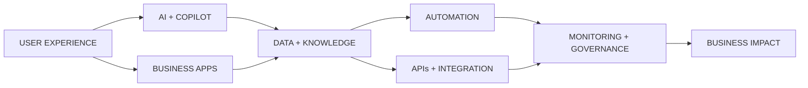

 

&nbsp;

  

────────

I DON’T JUST AUTOMATE TASKS.

I DESIGN SYSTEMS THAT THINK, ACT & SCALE.

I build at the intersection of intelligent automation, enterprise systems and AI — turning fragmented processes into digital experiences that are simpler, faster and more reliable.

 

COMPLEXITY → CLARITY → DESIGN → AUTOMATION → INTELLIGENCE → IMPACT

────────

01 · SYSTEM MAP

Users shouldn’t have to understand the architecture. They should feel the result.

────────

02 · WHAT I BUILD

<table>
<tr>
<td width="25%" align="center" valign="top">

✦ AI

ASSISTANTS

Copilot Studio
Knowledge Systems
Conversational AI
RAG Experiences

</td>
<td width="25%" align="center" valign="top">

⚡ INTELLIGENT

AUTOMATION

UiPath
Power Automate
RPA
Process Orchestration

</td>
<td width="25%" align="center" valign="top">

◇ ENTERPRISE

APPLICATIONS

Power Apps
Dataverse
Business Rules
Digital Workflows

</td>
<td width="25%" align="center" valign="top">

⌁ RELIABLE

OPERATIONS

Monitoring
Alerting
Exception Handling
Governance

</td>
</tr>
</table>

────────

03 · TOOLBOX

  

  

REST APIs · SAP · Azure OpenAI · Cloud · Monitoring · Enterprise Integration

────────

04 · GITHUB SIGNAL

  

────────

05 · THE BUILD TRAIL — LIVE

<picture>
  <source media="(prefers-color-scheme: dark)" srcset="https://raw.githubusercontent.com/lameskhaled/lameskhaled/output/github-contribution-grid-snake-dark.svg" />
  <source media="(prefers-color-scheme: light)" srcset="https://raw.githubusercontent.com/lameskhaled/lameskhaled/output/github-contribution-grid-snake.svg" />
  
</picture>

────────

06 · HOW I THINK

UNDERSTAND → QUESTION → SIMPLIFY → DESIGN → BUILD → TEST → SCALE

  

BUSINESS FIRST. TECHNOLOGY SECOND.

I don’t begin with “What can this tool do?”

I begin with:

“What should this experience feel like when we’re finished?”

────────

07 · THE PERSON BEHIND THE SYSTEMS

<table>
<tr>
<td width="25%" align="center" valign="top">

CURIOUS

I need to know why something works.

</td>
<td width="25%" align="center" valign="top">

CREATIVE

There is rarely only one way to build it.

</td>
<td width="25%" align="center" valign="top">

QUALITY-DRIVEN

Working isn’t enough. It should be reliable.

</td>
<td width="25%" align="center" valign="top">

BUSINESS-MINDED

The best technology creates real value.

</td>
</tr>
</table>

────────

THIS IS ONLY THE DASHBOARD.

THE REAL STORY IS IN THE WORK.

 

  

Architecture · Experience · Builds · Systems · Credentials

  

LAMES KHALED

INTELLIGENT AUTOMATION × ENTERPRISE AI × DIGITAL SYSTEMS

  

 