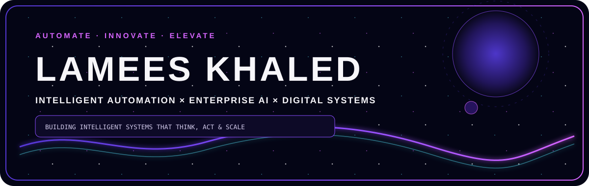
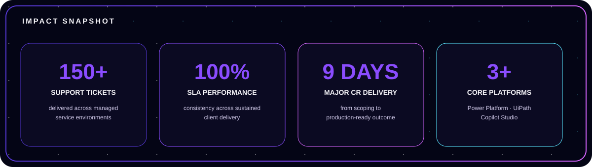
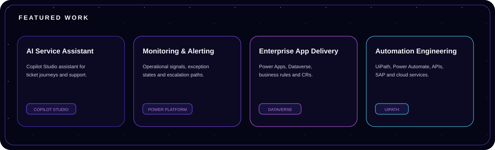
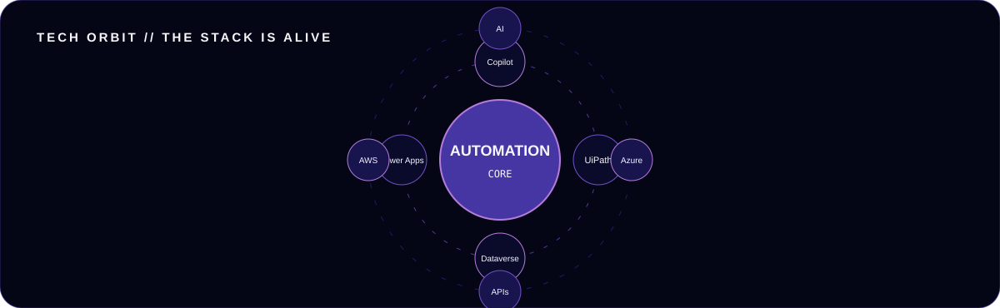
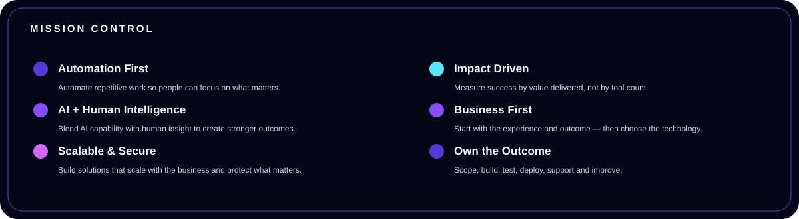
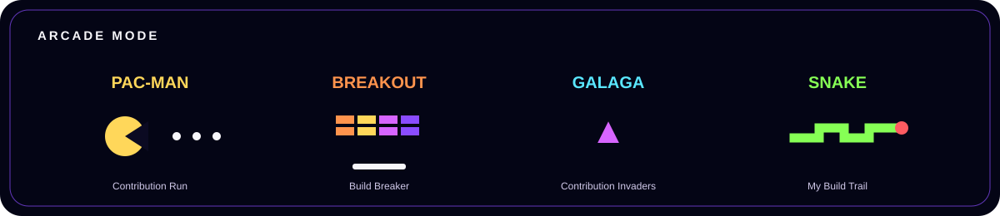
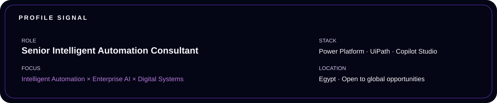
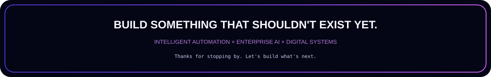

 

 

&nbsp;

 

## About Me

I’m a **Senior Intelligent Automation Consultant** building at the intersection of **AI, automation, enterprise applications and digital operations**.

I turn complex business processes into systems that are **clearer, faster, more reliable and easier to scale** — combining hands-on engineering with systems thinking, ownership and a strong focus on real user outcomes.

> **Business first. Technology second. The outcome is the point.**

 

## Impact Snapshot

 

## Featured Work

 

## Tech Orbit

  

  

**Power Platform** · **Power Apps** · **Power Automate** · **Dataverse** · **Copilot Studio**  
**UiPath** · **Azure OpenAI** · **REST APIs** · **SAP** · **AWS** · **Azure**

 

## Mission Control

 

## Arcade Mode

 

### PAC-MAN

<picture>
  <source media="(prefers-color-scheme: dark)" srcset="https://raw.githubusercontent.com/lameskhaled/lameskhaled/output/pacman-contribution-graph-dark.svg">
  <source media="(prefers-color-scheme: light)" srcset="https://raw.githubusercontent.com/lameskhaled/lameskhaled/output/pacman-contribution-graph.svg">
  
</picture>

### BREAKOUT

<picture>
  <source media="(prefers-color-scheme: dark)" srcset="https://raw.githubusercontent.com/lameskhaled/lameskhaled/output/breakout-contribution-graph-dark.svg">
  <source media="(prefers-color-scheme: light)" srcset="https://raw.githubusercontent.com/lameskhaled/lameskhaled/output/breakout-contribution-graph.svg">
  
</picture>

### GALAGA

<picture>
  <source media="(prefers-color-scheme: dark)" srcset="https://raw.githubusercontent.com/lameskhaled/lameskhaled/output/galaga-contribution-graph-dark.svg">
  <source media="(prefers-color-scheme: light)" srcset="https://raw.githubusercontent.com/lameskhaled/lameskhaled/output/galaga-contribution-graph.svg">
  
</picture>

 

## Contribution Trail

<picture>
  <source media="(prefers-color-scheme: dark)" srcset="https://raw.githubusercontent.com/lameskhaled/lameskhaled/output/github-contribution-grid-snake-dark.svg"/>
  <source media="(prefers-color-scheme: light)" srcset="https://raw.githubusercontent.com/lameskhaled/lameskhaled/output/github-contribution-grid-snake.svg"/>
  
</picture>

 

## Profile Signal

 

 

&nbsp;

